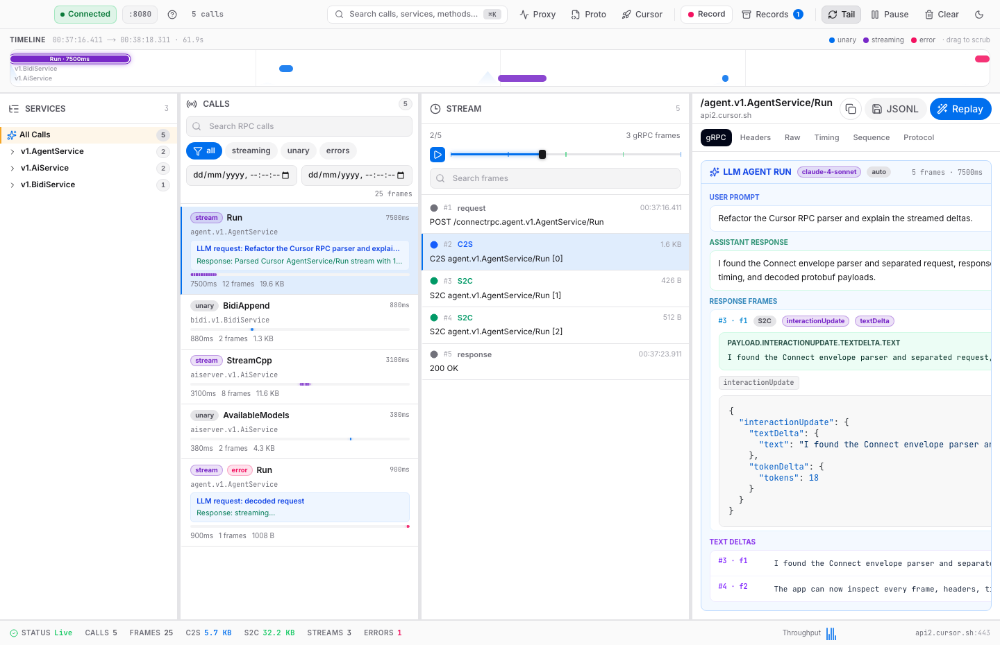
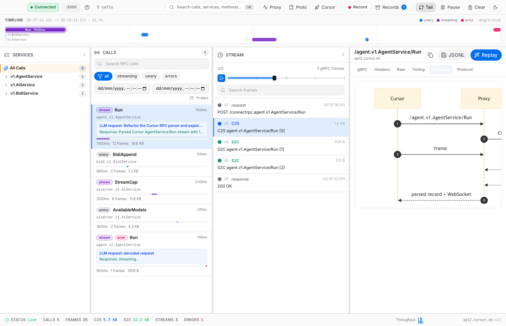
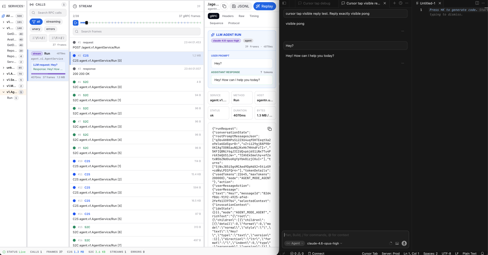

# Cursor-Tap App

<p align="center">
  
</p>

<p align="center">
  <a href="README.md">English</a> · <a href="README.zh-CN.md">简体中文</a>
</p>

Cursor-Tap App 是一个从 `cursor-tap` fork 演进出来的 macOS 桌面 App。这个版本把原来的抓包/解析能力 App 化，加入更细粒度的 gRPC frame 捕获、请求/响应/stream 分层查看、一键启动 Cursor，以及从 Cursor `.app` 自动解析 JS/proto 的流程。

Wails 提供原生桌面壳，Go 负责本地代理、MITM、协议解析和 SQLite 持久化，Next.js 静态前端负责 Inspector UI。目标是打开 App 后就能完成：启动代理、加载协议、启动 Cursor、实时查看 AI 请求和流式响应。

## 截图







## 这个 fork 做了什么

- **App 化**：用 Wails 封装为 macOS 桌面 App，不再把 WebUI 和 CLI 当作主要入口。
- **一键启动链路**：在 App 内启动代理、选择或自动定位 Cursor、注入代理环境并启动 Cursor。
- **自动解析 Cursor JS**：从 Cursor `.app` 内部 JS 或本地 `.js/.proto` 文件提取 proto source，运行时注册动态消息类型。
- **更细粒度抓取**：按 RPC call、frame、direction、headers、payload、timing 和 sequence diagram 拆开查看。
- **本地持久化**：records、sessions、protocol_versions、settings 写入本机 SQLite，运行时数据不放进仓库。
- **Release 规范化**：提供 GitHub release notes 分类、macOS 双架构构建和 zip/sha256 上传 workflow。

## 运行 App

```bash
make start
```

开发模式会启动 Wails，并让桌面 App 连接本地 Next.js 前端。

## 打包 macOS App

```bash
make build-mac
```

构建产物输出到 Wails 的 `build/bin/`，该目录不提交到仓库。

生成 GitHub Release 可上传的 zip 和校验文件：

```bash
make release-mac VERSION=v0.1.0
```

产物会输出到 `build/release/`，包含 `.app` zip 和 `.sha256`。

## GitHub Release

仓库内置 GitHub Release 自动化：

- `.github/release.yml`：按 GitHub 自动生成 release notes 的配置分类 PR。
- `.github/workflows/release-macos.yml`：发布 Release 或手动运行 workflow 时，构建 `arm64` 和 `amd64` macOS App，上传 zip 与 sha256。

推荐流程：

```bash
git tag v0.1.0
git push origin v0.1.0
```

然后手动运行 `Release macOS App` workflow 并输入 `v0.1.0`。workflow 会创建 draft release、调用 GitHub 自动生成 release notes，并上传两个 macOS App 产物。确认 notes 和资产无误后再发布 draft release。

也可以直接在 GitHub Releases 发布 `v0.1.0`，发布事件会触发同一个 workflow 并补上传资产；如果仓库启用了 immutable releases，建议使用上面的 draft release 流程。

## 验证

```bash
make test
make e2e
```

- `make test`：运行前端 lint、前端静态构建和 `go test ./...`。
- `make e2e`：启动测试代理、临时 SQLite、临时证书、fixture 协议、fake upstream 和 fake Cursor client，并用 Playwright 验证 UI。

## 使用方式

1. 运行 `make start` 打开桌面 App。
2. 点击 `Start Proxy` 启动本地代理。
3. 点击 `Proto`，选择 Cursor `.app` 或本地 `.js/.proto` 协议文件；App 会自动提取并注册 proto。
4. 点击 `Cursor` 一键启动 Cursor，并自动注入代理环境。
5. 在 Cursor 内触发 AI 请求，App 会实时显示 service、call、frame、payload、headers、timing 和时序图。

App 启动 Cursor 时会注入：

```bash
HTTP_PROXY=http://127.0.0.1:8080
HTTPS_PROXY=http://127.0.0.1:8080
ALL_PROXY=http://127.0.0.1:8080
NODE_TLS_REJECT_UNAUTHORIZED=0
```

运行时数据、SQLite、日志、JSONL 抓包和证书都应写入本机用户目录，例如 `~/.cursor-tap/data`，不要提交到仓库。

## 原理

1. **桌面壳**：Wails v2 嵌入 Next.js `web/out`，开发模式指向 `http://localhost:3000`。
2. **代理**：本地 HTTP/SOCKS5 代理接收 Cursor 的 `CONNECT`，用自签 server cert 解 TLS，再转发到 `api2.cursor.sh`。
3. **协议加载**：运行时从 Cursor `.app` 或本地 `.js/.proto` 提取 proto source，使用 `protocompile` 和 `dynamicpb` 注册动态消息类型。
4. **记录持久化**：records、sessions、protocol_versions、settings 写入 SQLite；WebSocket 同步推送新增 record。
5. **UI 展示**：HeroUI 四栏 Inspector，Shiki 高亮 payload/proto/headers，Mermaid sequence diagram 展示 Cursor -> Proxy -> api2.cursor.sh 时序。

## CLI 备用入口

桌面 App 是默认入口。需要只启动代理时，可以使用备用 CLI：

```bash
go run ./cmd/cursor-tap start \
  --http-port 8080 \
  --api-port 9090 \
  --sqlite ~/.cursor-tap/data/cursor-tap.sqlite \
  --protocol /path/to/cursor-or-fixture.js
```

前端开发模式：

```bash
cd web
npm ci
npm run dev
```

## 项目结构

```text
├── main.go                 # Wails App 入口
├── wails.json              # Wails v2 配置
├── Makefile                # 开发、测试和打包命令
├── .github/                # GitHub Release notes 和 macOS App 构建 workflow
├── build/                  # App 图标和 macOS 打包配置
├── cmd/cursor-tap/         # 代理 CLI
├── cursor_proto/           # Cursor proto source 和生成代码
├── internal/
│   ├── ca/                 # 单个自签 server cert
│   ├── e2e/                # Go 端到端测试
│   ├── httpstream/         # Connect/gRPC 解析与记录
│   ├── mitm/               # TLS MITM 和转发
│   ├── protoextract/       # 运行时协议提取/动态注册
│   ├── proxy/              # HTTP/SOCKS5/API/WebSocket server
│   └── storage/            # SQLite
└── web/                    # Next.js + HeroUI 前端
```
